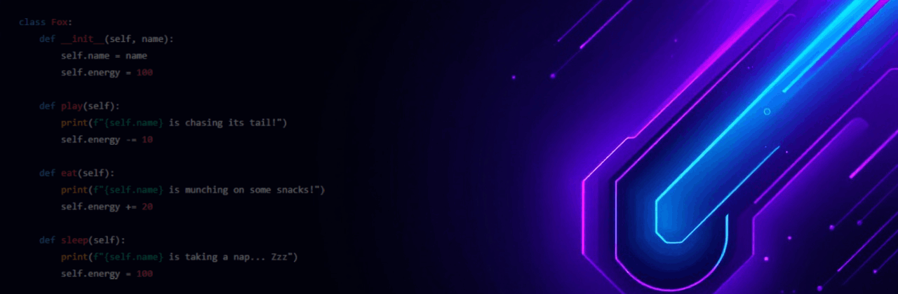
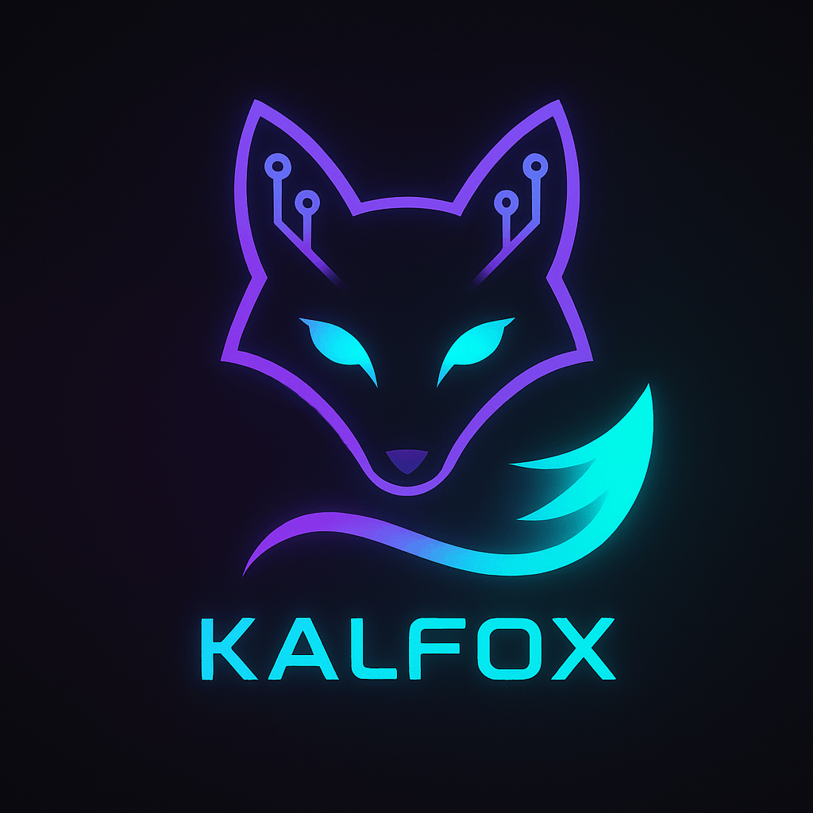

  

---

  

Hey there! I'm **Kalfox**, a passionate software engineer who blends clean code with a little fox-flavored flair. Whether I’m building sleek UIs, crafting powerful backend systems, or designing playful user experiences. I'm all about turning ideas into polished, purpose-driven products.

---

## My Skills

- **Languages:**

  
  
  
  
  
  
  
  
  

- **Frameworks & Tools:**

  
  
  
  
  
  
  

- **Focus Areas:** UI/UX, animations, creative user interaction

---

## Projects I'm Proud Of

- **FoxLoader** *(In Progress)*  
  A customizable animated splash screen for Windows to hide desktop till system fully loads up.

- **CarSpotterHub**  
  A beautiful hard-coded car information site with a sleek UI.

---

## My Vibe

I’m a developer with a soft spot for originality and detail. I treat my code like art, and I believe personality should shine through every project even if it’s just a splash screen. ✨

---

## Let's Connect

-  GitHub: [ItsKalfox](https://github.com/ItsKalfox)
-  LinkedIn: [in/itskalfox](https://www.linkedin.com/in/itskalfox/)
-  Twitter/X: [@ItsKalfox](https://***) *(Coming Soon)*

---

### ⚡ “Stay clever. Code foxy.” 🦊
