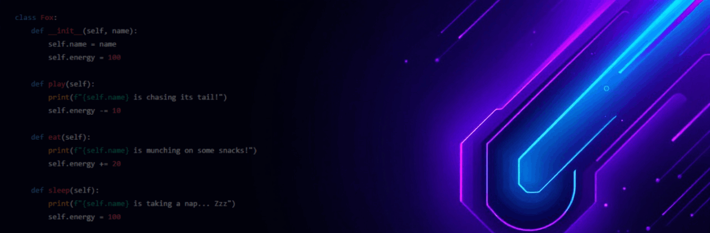

  

---

  

Hey there! I'm **Kalfox**, a passionate software engineer who blends clean code with a little fox-flavored flair. Whether I’m building sleek UIs, crafting powerful backend systems, or designing playful user experiences. I'm all about turning ideas into polished, purpose-driven products.

---

## 🧠 My Skills

- 💻 **Languages:** Python, C, C#, HTML, CSS, JavaScript  
- 🛠️ **Frameworks & Tools:** .NET, Visual Studio, Git, GitHub  
- 🎨 **Focus Areas:** UI/UX, animations, creative user interaction

---

## 🚀 Projects I'm Proud Of

- **🖥️ FoxLoader** *(In Progress)*  
  A customizable animated splash screen for Windows — loads your startup apps with style and speed!

- **🌐 CarSpotterHub**  
  A beautiful hard-coded car information site with a sleek UI.

---

## 🌟 My Vibe

I’m a developer with a soft spot for originality and detail. I treat my code like art, and I believe personality should shine through every project — even if it’s just a splash screen ✨

---

## 📫 Let's Connect

- 🐾 GitHub: [@ItsKalfox](https://github.com/ItsKalfox)
- 🐦 Twitter/X: [@ItsKalfox](https://***) *(Coming Soon)*

---

### ⚡ “Stay clever. Code foxy.” 🦊
