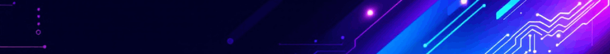

  

---

  
  
  

Hey there! I'm Kalfox, a dedicated software engineer who blends clean code with a little fox-flavored flair. My work spans across frontend design, backend development, and user-centric application architecture. I take pride in crafting solutions that are both efficient and thoughtfully designed.

I'm also the founder of TailCoded, an independent software studio focused on developing innovative and refined digital products. TailCoded is my personal playground for delivering quality-driven software with a unique creative touch.

---

## My Skills

- **Languages:**

  
  
  
  
  
  
  
  
  

- **Frameworks & Tools:**

  
  
  
  
  
  
  

---

## My Vibe

I’m a developer with a soft spot for originality and detail. I treat my code like art, and I believe personality should shine through every project even if it’s just a splash screen. ✨

---

## Projects I'm Proud Of

- **FoxLoader** *(In Progress)*  
  A customizable animated splash screen for Windows to hide desktop till system fully loads up.

- **CarSpotterHub**  
  A beautiful hard-coded car information site with a sleek UI.

---

## Currently Exploring

- Remote administration & local networking for custom tools
- Full-stack development with .NET (C#)
- UI/UX animation enhancements for desktop experiences
- Ethical hacking & cybersecurity fundamentals *(planning stage)*

---

## Open To

- Collaboration on creative and UI-focused software projects
- Frontend/backend freelance gigs
- Beta testing unique apps/tools (especially foxy or furry-themed 🦊)

---

## Let's Connect

|||
|---|---|
|  GitHub | [ItsKalfox](https://github.com/ItsKalfox) |
|  LinkedIn | [in/ItsKalfox](https://www.linkedin.com/in/ItsKalfox/) |
|  Discord | [@itskalfox](https://www.discord.com/users/764125655934959636/) |
|  Twitter/X | [@ItsKalfox](https://***) *(Coming Soon)* |

---

### ⚡ “Stay clever. Code foxy.” 🦊
